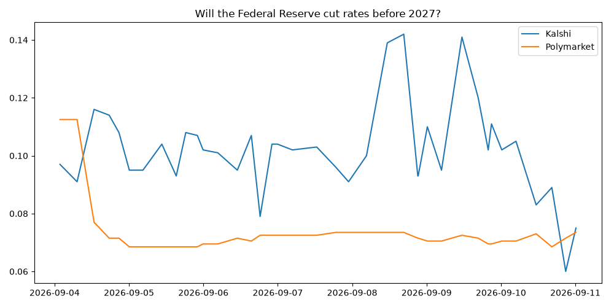

# Prediction Market Pipeline MVP

Kalshi and Polymarket both price the same real-world events. They don't always agree. This pulls both into Supabase on a schedule and measures the gap.

**[Full write-up (PDF)](./Prediction_Market_Pipeline_Report.pdf)** · 19 markets tracked · 773 snapshots · collecting since 2026-09-02



Both lines above are the same question: will the Fed cut rates before 2027? Getting this chart to mean anything required catching that the two platforms phrase the question in opposite directions. Comparing them raw showed a fake 80-point gap that was really just inverted polarity.

## What it found

- **The platforms diverge, then stop diverging.** Across 39 aligned snapshots the Kalshi:Polymarket ratio on the Fed pair averaged 1.40, swinging between 0.81 and 1.94. But both series drifted down over the window and finished within a thousandth of each other (0.075 vs 0.074). One week is not enough to call that a platform difference.
- **The divergence isn't uniform across markets.** RFK Jr. tracks tightly (ratio mean 0.70, std 0.06, never leaving 0.64 to 0.78). Pete Hegseth is noisier (0.85, std 0.12) and tops out at 1.07, meaning Kalshi sometimes prices it *above* Polymarket. Averaging the two together would hide that.
- **Contract structure drives repricing more than asset class does.** Polymarket's touch-by-deadline Bitcoin markets are the fastest-moving things tracked; Kalshi's price-on-a-date Bitcoin buckets are the slowest. Same asset, opposite ends of the ranking, because one reprices on every move toward the barrier and the other only cares where price finishes.

## How it works

```
ingest/     Kalshi + Polymarket pulls, shared logging, resolutions backfill, health check
analysis/   reads the data back out, builds charts, computes stats, assembles the PDF
```

Six tables in Supabase: `platforms`, `markets`, `market_snapshots` (the core time series), `resolutions`, `cross_platform_links`, `kol_theses`. RLS is on; ingestion writes with the service_role key, which bypasses it.

Two workflows live in the repo root `.github/workflows/` (Actions won't find them in a subfolder): ingestion, and an independent health check every 6 hours that fails loudly if snapshots go stale.

**The analysis window is frozen in `analysis/config.py`.** The pipeline keeps collecting, so an unfiltered analysis would silently change every run and the numbers in the PDF would drift away from the charts next to them. `analysis/report.py` writes every quoted figure to `analysis/output/stats.json`, and `build_report.py` reads that file instead of holding hardcoded numbers. Move `ANALYSIS_END` forward when you want the report to cover newer data.

## Running it

```bash
python -m venv venv && venv\Scripts\activate
pip install -r requirements.txt
cp .env.example .env      # then fill in your Supabase URL + service_role key
```

```bash
python -m ingest.run_kalshi        # one snapshot per watchlist market
python -m ingest.run_polymarket
python -m analysis.report          # regenerate charts AND stats.json
python -m analysis.build_report    # rebuild the PDF from them
```

Charts first, then the PDF. Doing it the other way embeds stale images and stale numbers.

`python -m ingest.refresh_market_metadata` re-fetches titles, close times and status without writing snapshots, for when you only want metadata corrected and don't want to move the end of the window.

## Gotchas worth knowing

- **Polymarket's `closed` param is a filter, not a hint.** Omit it and you silently only get open markets, so a resolved market comes back as an empty list. This quietly broke resolution detection until it was caught.
- **Polymarket slugs aren't stable.** The same price threshold gets re-listed under a new slug once the old one resolves, so `external_id` stores Polymarket's numeric id instead. Re-verify watchlist slugs periodically.
- **Polymarket doesn't expose open interest per market**, only per event, which aggregates across sibling markets. Left NULL rather than filled with a misleading number.
- **Kalshi reuses one title for every market in an event.** All five BTC strike buckets come back as "BTC price on Jan 1, 2027?"; the strike is in `yes_sub_title`. Without appending it, five distinct markets share a label and the volume chart draws five identical bars.
- **Don't read dates out of Kalshi tickers.** `KXCABOUT-26MAY22-RFK` actually closes 2029-01-20. Use the `close_time` field.
- **GitHub's cron is best-effort.** The ingestion workflow asks for every 2 hours and sees a 4.6h median gap, 34.6h worst case, about 40% of requested runs. Runs that fire complete normally, so this is GitHub dropping scheduled events. Note that the 40% is an upper bound, since snapshot rows don't record whether a run was scheduled, manual, or local. If you need a guaranteed interval, this is the wrong scheduler.
